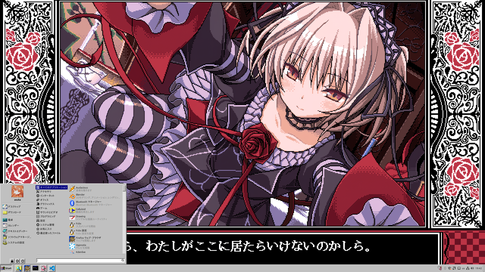
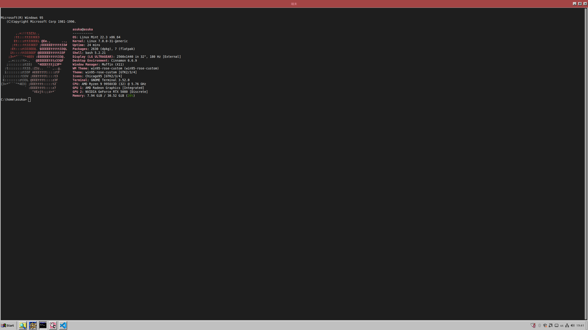

# win95-rose-custom

A Windows 95 desktop theme for **Cinnamon**, with dusty rose titlebars instead of
the original navy.

Derived from [Chicago95](https://github.com/grassmunk/Chicago95) by Grassmunk and
contributors, licensed CC-BY-SA 4.0. See `CREDITS` for the original authors.
This copy is trimmed to Cinnamon and carries local changes; it is not tracked
against the upstream repository.

The panel, the Start button and the menu, with the rose titlebars on the window
above them.

`make install_shell` gives a new terminal the Windows 95 startup banner, a
`C:\` prompt and fastfetch with the flag recoloured to the theme.

## What's in here

| Path | Contents |
| --- | --- |
| `Theme/win95-rose-custom` | GTK2, GTK3, GTK4, Cinnamon shell and window border theme |
| `Icons/` | `Chicago95` icon theme, plus the `-tux` and `-puffy` variants |
| `Cursors/` | cursor themes, including the animated hourglass |
| `Fonts/` | the Perfect DOS VGA fonts |
| `sounds/` | Windows 95 sound theme |
| `Extras/` | wallpapers and patterns, MS-DOS shell prompt, fastfetch config, recolour script, fontconfig snippets, Qt colour scheme |
| `wallpaper.png` | the desktop wallpaper |
| `VSCode/` | VS Code colour theme |
| `install-deps.sh` | installs the packages the theme needs, plus fastfetch |
| `apply-settings.sh` | switches Cinnamon to the theme; the install targets run it |
| `shell-setup.sh` | MS-DOS prompt, Windows 95 banner and fastfetch in `~/.bashrc` |
| `vscode-theme.sh` | installs and selects the VS Code theme; the install targets run it |
| `vscode-patch.sh` | inlines the VS Code stylesheet into `workbench.html`; needs root |
| `system-cursor.sh` | cursor for the login screen and root apps; needs root |
| `install-plymouth.sh` | the Windows 95 boot splash; needs root |
| `Plymouth/` | boot splash theme |
| `wine-colors.sh` | the theme's colours for Wine and Proton games |
| `login-sound.sh` | the Windows 95 login and logout sounds; needs root |
| `Lightdm/` | login screen theme (needs `lightdm-webkit2-greeter`) |
| `INSTALL.md` | the installation guide |

## Install

[INSTALL.md](INSTALL.md) is the full guide, including the optional extras, the
login screen, VS Code and how to undo it all. The short version:

For the current user:

    make install_user

System-wide:

    sudo make install

Either one also switches your desktop over: the Cinnamon theme, window borders,
Chicago95 icons, the white cursor, `wallpaper.png` as the background, the Start
button described below, and the GTK4 stylesheet described after it. The sound
theme is installed but not switched on; `sudo make install_login_sound` uses the
Windows 95 login and logout sounds. Log out and back in (or restart Cinnamon with **Ctrl+Alt+Esc**) if anything looks half
applied, and restart open applications.

`make uninstall_user` removes the files and puts the Cinnamon defaults back.
It changes the background only if it is still this wallpaper.

To reapply the settings without reinstalling:

    sh apply-settings.sh ~/.themes/win95-rose-custom ~/.local/share/backgrounds/win95-rose-custom.png

## Login screen and root applications

The login screen and programs started with administrator rights (Timeshift,
GParted, the update manager) do not read your session settings, so they keep the
default arrow pointer unless the cursor is set for them too. `sudo make install`
does this: it puts the cursor themes in `/usr/share/icons`, points
`/usr/share/icons/default` at `Chicago95_Cursor_White`, and writes
`cursor-theme-name` into `/etc/lightdm/slick-greeter.conf`.

Just that part, without installing the rest system-wide:

    sudo make install_system_cursor

The originals are saved next to the files as `.bak`, and `sudo make uninstall`
puts them back. The login screen changes at the next reboot; root applications
change as soon as they are restarted. Mint's own greeter settings (background,
clock, and so on) are left as they are.

## The Start button

The menu applet is set to the `start-here` icon from the Chicago95 icon theme —
the Windows 95 flag — with the text **Start** beside it, at a 22px icon size to
match the other panel applets. The label is bold, as it was in Windows 95; the
rest of the panel's labels are not.

The icon and the text are applet settings rather than theme properties, so they
live in the applet's own config file, `~/.config/cinnamon/spices/menu@cinnamon.org/*.json`,
and `apply-settings.sh` writes them there. The previous settings are saved
alongside as `.bak`, and `make uninstall_user` puts just those keys back, so
anything else you changed in the applet's settings meanwhile is kept.

To change the icon or the wording, edit `MENUICON`, `MENULABEL` and
`MENUICONSIZE` at the top of `apply-settings.sh`, or simply right-click the
panel and use *Configure* — the theme does not overwrite it again until the
next install.

The bold label comes from `.menu-cinnamon-org-applet .applet-label` in
`Theme/win95-rose-custom/cinnamon/cinnamon.css`. Cinnamon builds that class
name from the applet's uuid, so the same trick targets any other applet.

## VS Code

VS Code is an Electron application and ignores the GTK theme, so it is matched
through its own settings instead. `vscode-theme.sh` copies the colour theme in
`VSCode/win95-rose-custom` to `~/.vscode/extensions`, selects it, and sets
`"window.titleBarStyle": "native"` so the titlebar and menus are drawn by GTK
and pick up the rose colours like any other window. Both install targets run it;
`make install_vscode` and `make uninstall_vscode` do just this part.

The theme is Windows 95 silver chrome — `#c0c0c0` surfaces, `#808080` borders,
black text — around a white editor, with the titlebar rose used for selections
and other active elements, and the DOS 16-colour palette in the terminal. Its
accent colours must stay in step with the four in `gtk-3.0/gtk.css`.

`window.menuStyle` is set to `custom` as well. A native titlebar otherwise means
native GTK menus, and those are drawn outside VS Code entirely, so neither the
colour theme nor the stylesheet reaches them and they keep their rounded corners.
Drawing them in VS Code puts them back under the theme.

Only `workbench.colorTheme`, `window.titleBarStyle` and `window.menuStyle` are
written to `~/.config/Code/User/settings.json`; the previous file is kept as
`.bak` and `--reset` puts just those three keys back, dropping them if they were
not there before. A settings file containing comments or trailing commas is left
alone with a message, since those are not valid JSON.

VS Code must be restarted, or the window reloaded, before the theme appears.

### Rounded corners

VS Code rounds its own corners, and a colour theme cannot reach them: the radii
are compiled in as design tokens with no setting behind them. `vscode-patch.sh`
inlines `VSCode/win95-rose-custom/win95-rose-custom.css` into VS Code's
`workbench.html`, which sets the six `cornerRadius` variables to zero and squares
off the places that hardcode a radius:

    sudo make patch_vscode      # add it
    sudo make unpatch_vscode    # put the original file back

It is inlined rather than linked because `workbench.html`'s Content-Security-Policy
allows `style-src 'unsafe-inline'` but not `file://` stylesheets. The original is
kept beside it as `workbench.html.bak`, and running the patch again replaces the
block rather than stacking another one on it.

Neither install target does this, and it is not something to do lightly:

- **The checksum in `product.json` is updated to match.** VS Code keeps SHA-256
  hashes of ten core files there and calls itself corrupt when one no longer
  matches, so the hash for `workbench.html` is corrected as part of the patch.
  The cost is losing the only automatic signal that this one file has changed.
  It is not a security boundary in either case: writing `workbench.html` already
  needs the root access that editing `product.json` needs. Pass
  `--keep-checksum` to leave `product.json` alone and dismiss the warning in
  VS Code instead. The original is kept as `product.json.bak`.
- **A VS Code update reverts both files**, since the package owns them. Run
  `sudo make patch_vscode` again afterwards.
- **The patch itself is not tracked here** — only the stylesheet is. The edit
  lives in the VS Code installation, so it is per machine.

The script edits the file as root rather than making it writable by your user:
leaving VS Code's startup HTML user-writable would let anything running as you
change what VS Code loads at launch.

The same stylesheet is where Windows 95 raised bevels for buttons and scrollbars
would go, which a colour theme also cannot do.

## GTK4 and libadwaita applications

Ordinary GTK4 applications follow the theme setting like GTK3 ones do. libadwaita
applications ignore it and always load Adwaita, but they do read a per-user
stylesheet. The install writes `~/.config/gtk-4.0/gtk.css` to import the
theme from there. If you already had that file, it is moved to `gtk.css.bak`,
and `make uninstall_user` puts it back.

Applications need restarting afterwards. Delete that file if you switch to an
unrelated theme, since it would otherwise keep styling them.

## Changing the colours

The titlebar and highlight colours live in two places, which must agree:

- `Theme/win95-rose-custom/gtk-3.0/gtk.css` — `window_title_bg_color`,
  `window_title_text_color`, `inactive_title_bg_color`, `inactive_title_text_color`
- `Theme/win95-rose-custom/gtk-4.0/gtk-colours.css` — the same four names

The current values are `#a34545` (active titlebar), `#eb98a8` (its text),
`#997c7c` (inactive titlebar) and `#262323` (its text).

`Theme/win95-rose-custom/metacity-1/metacity-theme-1.xml` holds the same colours
for the window border entry in System Settings. Current Cinnamon draws window
titlebars from the GTK stylesheet rather than that file, so it is kept only so the
theme appears in the *Window borders* list.

Cinnamon caches a theme's stylesheet once it has loaded it. After editing, restart
Cinnamon with **Ctrl+Alt+Esc** to see the change.

`Extras/recolor.py` can remap the whole palette at once, writing a recoloured copy
of the theme rather than editing this one in place.

## Notes

- **The GTK4 theme is generated from the GTK3 one**, not shared with it: GTK4
  dropped widget style properties, renamed several widgets and is stricter about
  syntax. Widget sizes are matched deliberately, so GTK3 and GTK4 windows line up.
- **GTK4 has no scrollbar stepper buttons**, so GTK4 applications lack the little
  arrows at the ends of scrollbars that GTK2 and GTK3 applications have.
- **Qt applications** are not themed. `Extras/Chicago95_qt.conf` is a colour scheme
  for qt5ct; alternatively `QT_QPA_PLATFORMTHEME=gtk2` makes Qt5 applications
  render through the GTK2 theme.
